## {.content-swoop data-menu-title="Stick fish"}

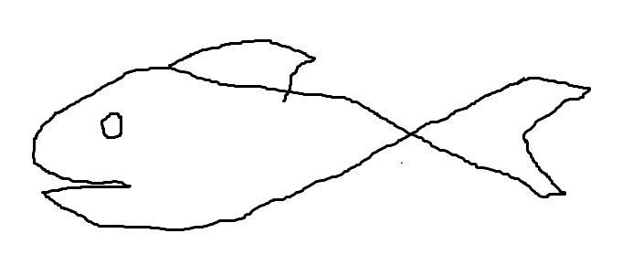{fig-alt="Overly simple fish drawing"}

::: {.notes}
...which turns out to be completely rubbish for learning anything! It's like trying identify a person from a stick figure drawing. Nowadays I'm sure you all can just take pictures with your phones, which hopefully would have helped me out, but instead I concluded I was too lousy of an artist to be a biologist of any kind and wanted nothing to do with biology.

But before I go any further :next_track_button:
:::

<!-- ---------------------------------------------------------------------- -->

## {.content-swoop transition="fade-out" data-menu-title="Float Plan"}

### Float Plan

:::: {.columns}
::: {.column width=40%}
- How I got here
- What I do
- How you can, too (Government Jobs 1000)
:::
::: {.column width=60% .smaller .dark-box color=white .centered}

**MEET MATT**

:ocean:  

[**Physical oceanographer**]{style="color:#003087"} by training  
  
:satellite:  

[**Observational oceanographer**]{style="color:#003087"} by practice  
  
:chart_with_upwards_trend:  

[**Applied machine learning researcher**]{style="color:#003087"} and [**data scientist**]{style="color:#003087"} by happenstance

:::
::::

::: {.notes}
...the obligatory float plan for the evening: I've been asked to talk about my career as a civil servant with NOAA, what that looks like and how I got here. I've decided to do that from the perspective of an abbreviated career talk. I myself have always enjoyed learning about colleagues' career paths because, even to this day, I always find myself surprised and, frankly, inspired, by their stories. It's helpful to be reminded that scientists' careers are rarely linear and predictable. And finally, in case I successfully inspire one or more of you to consider a career in government, I'll end with some suggestions for how to make that dream become a reality. :next_track_button:
:::

<!-- ---------------------------------------------------------------------- -->

## {.content-swoop data-menu-title="Hold slide"}

::: {.notes}
I'd like to start with a quote from my Master's advisor that really resonated with me and that I remember to this day.
:::

## {background-image="https://d9-wret.s3.us-west-2.amazonaws.com/assets/palladium/production/s3fs-public/styles/full_width/public/thumbnails/image/rvSharp.jpg?itok=4Qxq9PgB" fig-alt="Photo of the R/V Hugh R. Sharp, courtesy of Jon Cox, University of Delaware" data-menu-title="UD | MS"}

::: {.smallest style="color: white;" .absolute bottom="5" right="0"}
R/V *Hugh R. Sharp*. Photo credit: Jon Cox
:::

::: {.notes}
A few months into my first year at the University of Delaware, my lab mate and I were figuring out how to balance our course work and thesis research while also going to sea for a week at a time every month to support another unrelated project my advisor had funded. Matt Oliver, our advisor, sat us down for a pep talk, as he did from time to time, and said to us :next_track_button::
:::

. . .

::: {.semi-transparent-box}
[**"Courses don't get people jobs. Neither do theses nor dissertations. *Skills* get people jobs. And you never know what skill will land you your first job."**]{style="color:#00467F"}  
[~Dr. Matthew Oliver]{style="float:right; color:#007078"} <br>

[University of Delaware]{style="float:right; color:#007078"}
:::

::: {.notes}

> Courses don’t get people jobs. And neither do degrees or theses or dissertations, for that matter. *Skills* get people jobs. The best thing you can do as a student is to start searching for jobs now, even though you still have time to go. Look for jobs that excite you, things that you’d like to do, and then see what skills they’re looking for. If there are things you don’t already know how to do, use the next year or so to learn it. Being in school is the best time to develop your skill toolbox! You never know what skill will land you your first job.

These words of wisdom have really rung true in my career, so listen for them resonating throughout this evening. They also sparked a paradigm shift in how I approached the rest of my education. I had been thinking about working for NOAA since my time as an undergraduate, but I didn't know what that would look like or how to make it happen. I assumed that having the right degrees with the right classes would do the trick, but as it turns out Matt was right: skill building was key.

I have to give credit where credit is due: Matt Oliver was a fantastic advisor and mentor who was always trying to set us up for success both during and after our time in his lab. In addition to the cruise experience, another opportunity I had as a Master's student was learning to operate :next_track_button:
:::

<!-- ---------------------------------------------------------------------- -->

## {background-iframe="https://www.youtube.com/embed/avXysAQ9iqc?start=5&mute=1&autoplay=1" background-interactive="true"  background-size="contain" data-menu-title="Gliders"}

::: {.notes}
Slocum gliders, which are low-powered buoyancy-driven autonomous underwater vehicles that can measure a host of physical, chemical, and biological properties in the ocean. Matt sent us to glider school to learn how to prep, deploy, pilot, and recover these instruments and arranged to have us test our skills in the Delaware Bay and eventually offshore. It was a lot of fun, but had nothing to do with my research project. As I was finishing up my Master's :next_track_button:
:::

<!-- ---------------------------------------------------------------------- -->

## {background-image="https://upload.wikimedia.org/wikipedia/commons/thumb/9/9d/Deepwater_Horizon_offshore_drilling_unit_on_fire_2010.jpg/1280px-Deepwater_Horizon_offshore_drilling_unit_on_fire_2010.jpg" background-color="black" background-size="contain" transition="fade-in fade-out" data-menu-title="Deepwater Horizon"}

::: {.notes}
...an oil rig called the Deepwater Horizon exploded in the northern Gulf of America :next_track_button:
:::

<!-- ---------------------------------------------------------------------- -->

## {background-image="https://www.nesdis.noaa.gov/s3/migrated/Deepwaterimagewithinset1.jpg" background-color="black" background-size="contain" data-menu-title="Oil spill from space"}

::: {.notes}
...and spilled millions of gallons of oil into the water over thirty-something days before it was finally contained. It was an environmentally devastating event to watch play out, but it was also paradoxically inspiring as a student to see the entire oceanographic community across the country spring into action to help out. This included in glider community, and so we prepped our glider and went on standby in case we were asked to bring it down to Louisiana.

Fast forward a few years and I landed a job as a research associate in the Ocean Observation Laboratory at the University of Massachusetts Dartmouth :next_track_button:
:::

<!-- ---------------------------------------------------------------------- -->

## {background-iframe="https://www.youtube.com/embed/aRyEDzaogPc?mute=1&autoplay=1" background-interactive="true" background-size="contain"  data-menu-title="SMAST"}

::: {.notes}
They needed someone to, among other things, manage their glider program. This is a video of a glider in their large acoustic test tank where I'd ballast and test it before deploying. I was the only applicant who had that training and experience, I later found out. My Master's degree did not get me that job -- in fact, it was advertised as "Bachelor's required, Master's preferred" -- those glider piloting skills got me the job. :next_track_button:
:::

<!-- ---------------------------------------------------------------------- -->

## {background-image="images/gom_front_ws.jpg" fig-alt="Ocean front photographed from the bridge of the R/V Walton Smith" data-menu-title="RSMAS | PhD"}

::: {.smallest style="color: white;" .absolute bottom="5" right="0"}
Photo credit: Tamay &Ouml;zg&ouml;kmen
:::

::: {.notes}
I did that for a couple years before deciding to back to school for my Ph.D. at the University of Miami with Dr. Tamay Ozgokmen. He's an interesting character himself: he spent the first decade of his career as an ocean modeler and made fun of sea-going oceanographers who got sea sick collecting small amounts of data. He was convinced that he could learn more about the ocean from the comfort of his office using circulation models. Then the Deepwater Horizon oil spill happened and he quickly learned that even the best circulation models failed to predict where the oil would go. So he then spent the next decade of his career conducting large scale field campaigns in the Gulf to better understand the material transport problem. :next_track_button:
:::

<!-- ---------------------------------------------------------------------- -->

## {background-iframe="https://player.vimeo.com/video/228250408?h=04a07d052e?autoplay=0" background-interactive="true"  background-size="contain" data-menu-title="CARTHE Overiew"}

::: {.smallest style="color: white;" .absolute bottom="5" right="0"}
Video courtesy of the Consortium for Advanced Research on Transport of Hydrocarbon in the Environment at the University of Miami.
:::

::: {.notes}
Here's one of the outreach videos that we used to explain our work to the general public. 

So that's where I came in. Tamay needed someone to dig into those data to help pioneer the "next generation of ocean circulation models." So, he brought me on as a Ph.D. student because of my experience gathering and analyzing oceanographic data and gave me considerable freedom to define my own research problem, which was a rather unique, though also daunting, experience. Meanwhile, he had become intrigued by machine learning and how it might become the future of oceanographic modeling, like it has in so many other fields :next_track_button:
:::

<!-- ---------------------------------------------------------------------- -->

## Lagrangian trajectory prediction {background-image="images/GLAD_animation.gif" data-menu-title="Drifter prediction" data-menu-title="SEFSC"}

::: {.notes}
I decided to make my dissertation research about testing machine learning with the drifter data from the large scale field experiments in that video. The biggest barrier to marine science adaptation of machine learning has been and largely continues to be the availability of - or, more accurately, the lack thereof - data. As you know, machine learning models are data hungry. That's the whole premise behind them. So, our thinking was, if machine learning is going to work anywhere in the ocean circulation problem, hopefully it'll work in this rare case of having over 5 million data points from a single type of instrument (drifters). I don't have time tonight to go into detail about that work, but I came out of that program as an observational physical oceanographer with machine learning experience, a unique combination of skills that, at the time, turned out to be quite marketable, because I finally landed my first NOAA job offer as I was finishing up my Ph.D. I later learned that my first supervisor liked my machine learning experience because they needed that expertise in house, but also liked my past observational oceanography experience because it showed that I understood not just the data themselves, but how the data are collected and all the complexities and complications that go with that. :next_track_button:
:::

# {.content-swoop auto-animate="true"}

The NOAA **Southeast Fisheries Science Center** (SEFSC) provides the scientific advice and data needed to effectively manage the living marine resources of the Southeast region and Atlantic high seas.

:::: columns
::: {.column width="60%"}
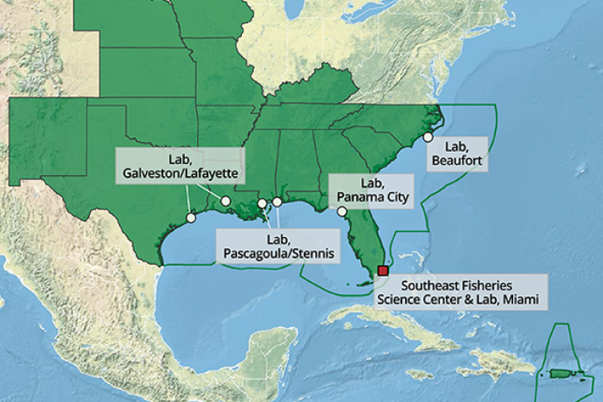
:::

:::: {.column .smallest width="40%"}
::: {.colored-box style="--background-color:#C6E6F0"}
::: {.centered}
**Mission Areas**
:::

:fish: Sustainable Fisheries  
:tropical_fish: Population and Ecosystems Monitoring  
:computer: Operations, Management, and Information  
:turtle: Marine Mammals and Sea Turtles    
:chart_with_upwards_trend: Fisheries Statistics  
:camera: Fisheries Assessment, Technology, and Engineering Support  

:::
::::
:::::

::: {.notes}
So now, here am I, one who avoided all things biology in school, working at, of all places, at the Southeast Fisheries Science Center I work with amazingly passionate and dedicated scientists, such as my colleague who retired this month after a remarkable 41 years of service during which he contributed to nearly every survey and shipboard research project based out of his lab and logged nearly 120 sea days this year alone before retiring. We are all distributed across a number of labs and facilities from Texas though the Caribbean and up to North Carolina, where I'm located, and we carry out an inspiring and motivating mission of *providing the scientific advice and data needed to effectively manage the living resources of the Southeast Region and Atlantic high seas.* We do this by partnering with fisheries management councils, fisheries commissions, and federal, state, and local agencies to, among many other things, carry out annual stock assessments for key species throughout the region. These assessments are always rooted in independent, objective science and contain such information as population estimates (counts), spatial distributions, age distributions, and the overall health of the particular species. This kind of information is then used to inform consequential policy decisions such as where can people fish and when, how much of each species can be kept, and things like that.

I'm a data scientist now, which means I'm not technically doing oceanography, but I'm solving technical problems related to the ocean, which I enjoy. My job is to collaborate with scientists all across the Center to understand the ways in which we are collecting data, processing it, and converting into useful information, and then find ways to streamline, modernize, and automate our workflows where possible. I personally have come to really enjoy automating things, even outside of work. It's just...oddly satisfying!  So my team and I are identifying parts of our mission that could be well-suited for machine learning and automation so that our limited staff and funding can be allocated to tasks that machines are not good at. :next_track_button:
:::

<!-- ---------------------------------------------------------------------- -->

# Reef Fish Surveys: <br> What's where, when, and why? {.divider data-menu-title="Reef Fish Surveys"}

::: {.notes}
For example, one way we improve stock assessments is by observing fish habitats and water quality to derive estimates of abundance, size, and community composition for key species in the region. :next_track_button:
:::

<!-- ---------------------------------------------------------------------- -->

## {background-iframe="https://players.brightcove.net/659677166001/4b3c8a9e-7bf7-43dd-b693-2614cc1ed6b7_default/index.html?videoId=6376453872112&autoplay=true&muted" data-menu-title="GFISHER"}

::: {.notes}
We do this by deploying cameras underwater and recording fish in their natural habitat. We use a system of 4-5 outward-looking cameras to get a 360&deg; view, mount them into a protective cage along with other oceanographic instruments for measuring oceanographic data, and lower it off the ship to record 20–30-minute videos at roughly 2000 randomly selected locations throughout the region each year. As you might expect, this results in many terabytes of video data that need to be processed. The traditional method is for expert scientists to sit in dark rooms and watch the videos all day every day to find, identify, and count fish species on each frame in each video. It's a very time-consuming process, and it currently takes us more than a year to process one year's worth of video. So obviously that's not sustainable; we can't keep up! So, this has become one candidate for machine learning since the rise of high performing computer vision models. We're currently deploying models that identify key species of fish in the videos and track them from frame to frame so that we can quickly get estimates of how many of each species are present, which we anticipate will shave off many months of processing time. But this is not without its challenges: visibility underwater changes from site to site, day to day, which can make some of the videos very difficult if not impossible to process. We also have a highly unbalanced data set, with some species being seen very often and others very rarely. So there is always room for more data and ongoing research and development as the machine learning field rapidly advances. :next_track_button:
:::

<!-- ---------------------------------------------------------------------- -->

# Life History Assessment: <br> Fish Ageing {.divider data-menu-title="Life History"}

::: {.notes}
Species counts is only one metric for habitat monitoring. We also need to know the age distribution of those species because... :next_track_button:
:::

<!-- ---------------------------------------------------------------------- -->

## {.content-swoop auto-animate="true" data-menu-title="Fish Ageing"}

#### But first, why age a fish? Who cares? 

::: {.centered}
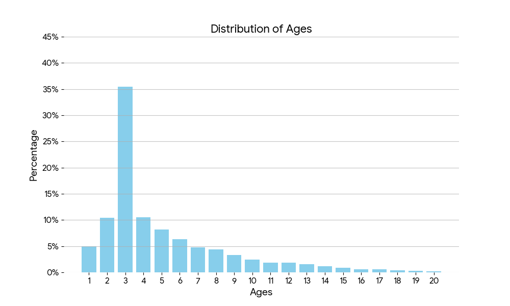{width=80%}
:::

::: {.notes}
...this allows us to estimate fish mortality rate from year to year, to determine reproductive maturity of the stock, and to monitor changes in population over time. If, for example, the vast majority of individuals in a given year are juvenile, it would be in our best management interest to limit fishing of that species so that those juveniles can grow and reproduce, lest we fish them out of existence. On the other hand, if all of the individuals are older or...shall we say, elderly fish...we know something is wrong that is either preventing reproduction or affecting the survival rate of young. So each year scientists collect samples of key species to be aged at a lab. Some species, like Atlantic and Gulf menhaden, are aged by looking at a scale under a microscope... :next_track_button:
:::

<!-- ---------------------------------------------------------------------- -->

## Otolith Ageing {.content-swoop auto-animate="true" data-menu-title="Otoliths"}

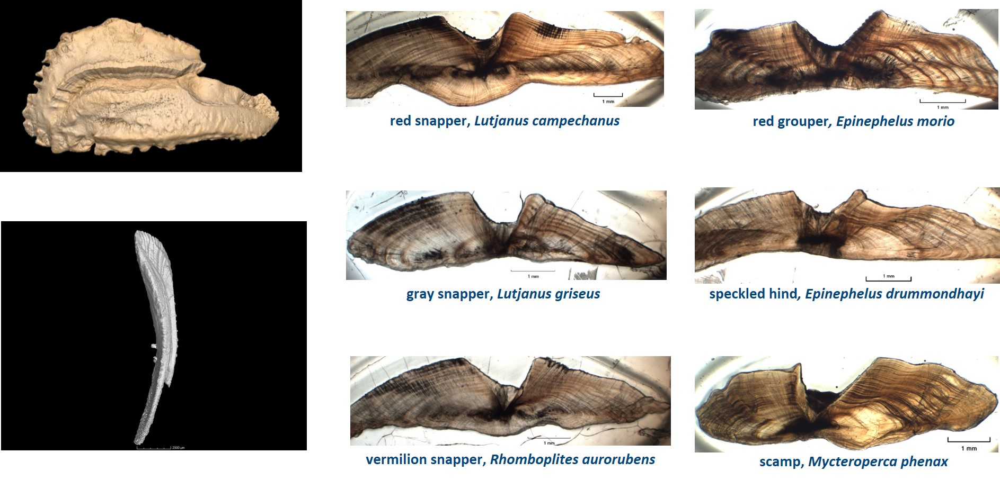

::: {.notes}
...while other species are aged using an otolith, a small ear bone that grows as the fish grows. :next_track_button:
:::

<!-- ---------------------------------------------------------------------- -->

## {.content-swoop auto-animate="true" data-menu-title="Otolith Ageing"}

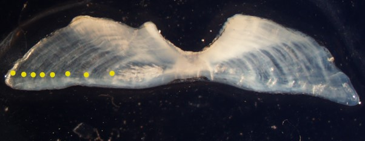  

<br>

::: {.small}
:date: **50-70 days (10-15 weeks)** of human hours to age 1000 otoliths, not including prep.  

:dizzy_face: But we receive thousands of samples every year! **Is there a better way?**
:::

::: {.notes}
In both cases, scientists look for and count rings or similar signals, much like counting tree rings. :next_track_button:
:::

<!-- ---------------------------------------------------------------------- -->

## {.content-swoop auto-animate="true" data-menu-title="Automated Ageing"}

#### Aging from spectrometry

::: {.centered}
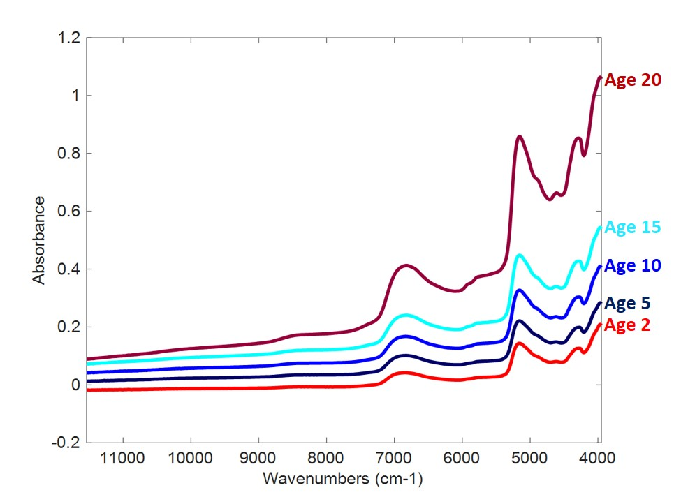{width=80%}
:::

<!-- 
```{mermaid}
flowchart LR
  A[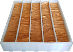 Otolith samples] --> B(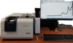 Spectrometer)
  A --> C(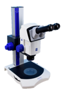 Microscope)
  B --> D[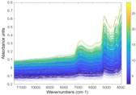 FT-NIR spectral data]
  C --> E[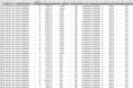 Manual ages]
  D --> F{Trained<br>model}
  E --> F
```

 -->

```{mermaid}
flowchart LR
  A[ New otolith samples] --> B( Spectrometer)
  B --> C[ FT-NIR spectral data]
  C --> D{Trained<br>model}
  D --> E( Ages provided<br>to end users)
```

::: {.notes}
Again, this has traditionally been done by humans, but we have trained computer vision and statistical models for a few initial species that can do much of this for us in a fraction of the time. :next_track_button:
:::

<!-- ---------------------------------------------------------------------- -->

# {.content-swoop auto-animate="true" data-menu-title="NOAA Mission Areas"}

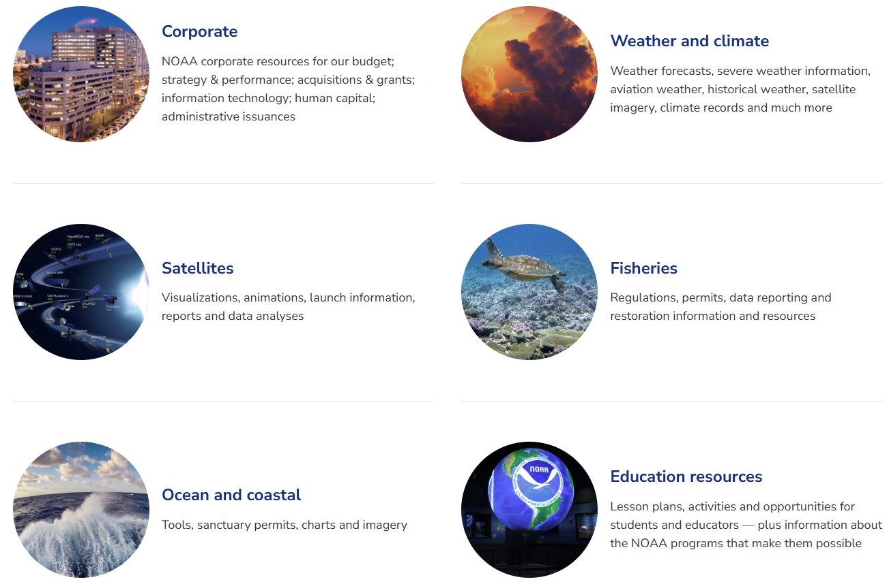

::: {.notes}
There are numerous other examples of exciting and promising work like this all throughout the agency. I really see this kind of innovation, along with cloud adaptation and the rise of uncrewed systems for data collection across all of NOAA's mission, as being areas of substantial growth in the years to come. But of course the commitment to other research and operational science will always be there too. NOAA's mission spans from the surface of the sun to the sea floor, and we do everything from research and science to policy and governance to education and outreach, all of which require a highly diverse workforce of domain scientists, communicators, lawyers, policy makers, law enforcement, budget folks, facilities support, IT, just to name a few...there is literally something for everyone. :next_track_button:
:::

<!-- ---------------------------------------------------------------------- -->

# Navigating government jobs {.divider}

::: {.notes}
Ok, so what if you're interested in working for NOAA or another federal agency; how does one make that happen? I'll offer a few ideas to conclude. First, I'll return to my former advisor's advice: start looking for government jobs and take note of what skills they require. For federal positions, specialized skills and experience are absolutely essential to qualifying for any job. Much more so than the private sector. So, start looking now, no matter what year you're in. It's never too early to figure out what skills to develop before you need them. :next_track_button:
:::

<!-- ---------------------------------------------------------------------- -->

## {background-image="images/usajobs_screenshot.png" auto-animate="true" data-menu-title="USAJOBS"}

::: {.absolute top="85%" left="65%" style="padding: 5px; background: rgba(255, 255, 255, 0.8); border-radius: 5px; border: 1px solid #ccc;"}
[View Live Site ↗](https://www.usajobs.gov){target="_blank"}
:::

[ ](https://www.usajobs.gov){.absolute top=0 left=0 width="100%" height="100%"}

::: {.notes}
The vast majority of federal jobs are posted on USAJOBS and every job will have a Qualifications section that describes the specialized experience you need to qualify. That could be a whole different seminar so I won't go into details today. :next_track_button:
:::

<!-- ---------------------------------------------------------------------- -->

## {.content-swoop auto-animate="true" data-menu-title="Sample JOAs"}

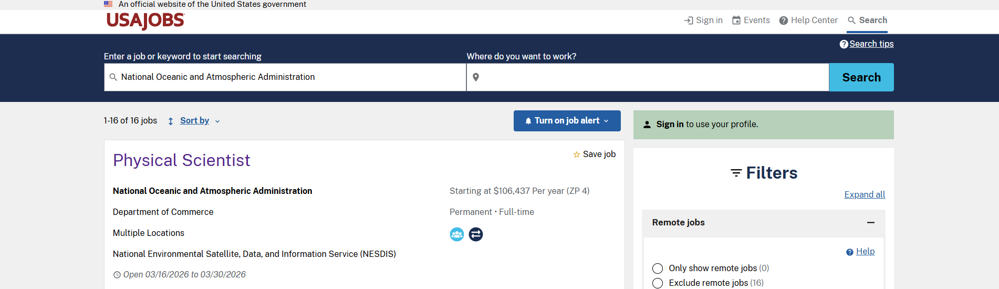

- [Meteorologist](https://www.usajobs.gov/job/854675700)
- [Meteorological Technician](https://www.usajobs.gov/job/860740400)
- [Research Physical Scientist](https://www.usajobs.gov/job/861651700)

::: {.notes}
I did pull a few relevant examples that we can look at afterwards if there's time and interest, but the links are here regardless. :next_track_button:
:::

<!-- ---------------------------------------------------------------------- -->

## {.content-swoop auto-animate="true" data-menu-title="Affiliates"}

[Cooperative Institutes](https://ci.noaa.gov/) (CI)

:::: {.columns2}
::: {.column}

:::
::: {.column}
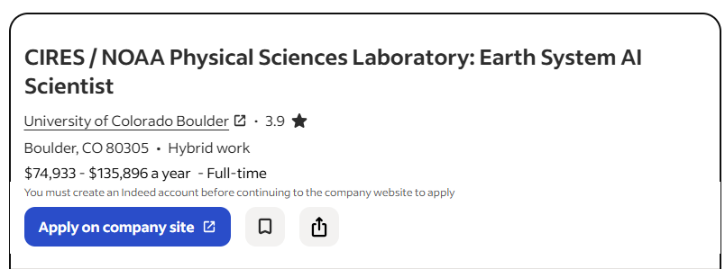
:::
::::

Government Contractors

:::: {.columns2}
::: {.column .small}
- Support specific projects
- Usually fills gaps in specialized skill sets
- Often 1-3 years at a time, but duration varies
:::
::: {.column}
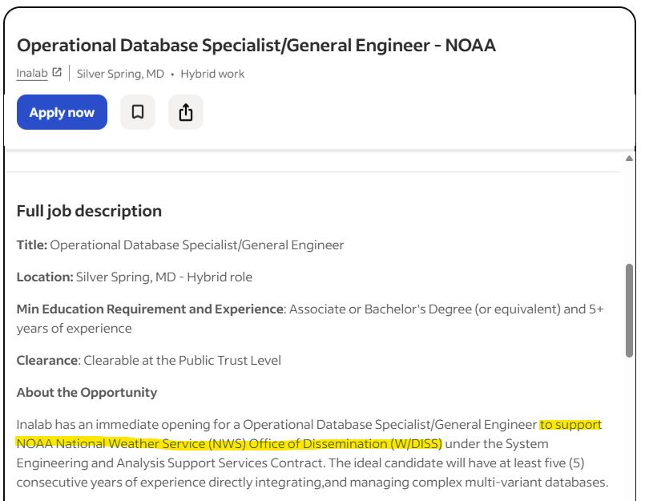
:::
::::

::: {.callout-note title="Disclaimer" .small}
These screenshots are randomly selected samples. Inclusion here does not constitute an endorsement of any of job or employer.
:::

<br>

::: {.notes}
Don't rule out government contractor jobs either, especially for non-citizens. Contractors and affiliate staff make up about half of our workforce at NOAA and are essential to carrying out our mission. We literally could not do it without them. These folks work for either private companies that usually exist solely for government contracts or at some universities throughout the country with whom we have cooperative agreements. These are called "cooperative institutes", there are about 15 of them I believe, each one specializing in and supporting a different part of NOAA's mission. There are advantages and disadvantages to both federal and contractor careers, but again, that could be a different seminar. Contractor positions will be advertised on their company or university sites, so you'll often find them on job platforms like LinkedIn or Indeed. :next_track_button:
:::

<!-- ---------------------------------------------------------------------- -->

## {.content-swoop auto-animate="true" data-menu-title="NOAA Corps"}

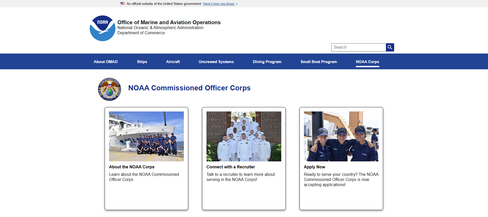

[Learn more about the NOAA Commissioned Officer Corps](https://www.omao.noaa.gov/noaa-corps)

::: {.notes}
I also invite you to check out the NOAA Corps, especially if things flying hurricane hunters and driving ships excites you. I honestly did not know about the NOAA Corps until later in my academic preparation, but that is such a unique opportunity, though certainly not for everyone. :next_track_button:
:::

<!-- ---------------------------------------------------------------------- -->

## Student Opportunities{.content-swoop auto-animate="true"}

]{.small}](images/noaa_internships_screenshot.png)

]{.small}](images/usajobs_internships_screenshot.png)

::: {.notes}
NOAA also offers many opportunities for student internships for both undergraduate and graduate students. Just Google "NOAA internships" and you'll find a number of pages. Each line office generally handles these separately, so find the parts of NOAA that appeal to you and check them out. Some of these opportunities include Sea Grant internships, the William M. Lapenta Student Internship Program, and others. And I'll also point out, something I did not know until much later, that the federal government has different hiring paths, meaning different ways you can qualify for jobs. One of these is a "recent graduates" path, which allows us to post entry level jobs designed specifically for recent graduates, which usually means within 5 years of graduation. So, you can look for these specifically on USAJOBS; NOAA definitely uses them when we can, and many other agencies do as well. Feel free to reach out to NOAA staff; we're busy and get lots of emails every day, but the vast majority of folks will happily respond to student inquiries. You just need to be patient sometimes. :next_track_button:
:::

<!-- ---------------------------------------------------------------------- -->

# Science. Service. Stewardship. {.divider data-menu-title="Contact Info"}

:::: {.columns2}
::: {.column width=25%}
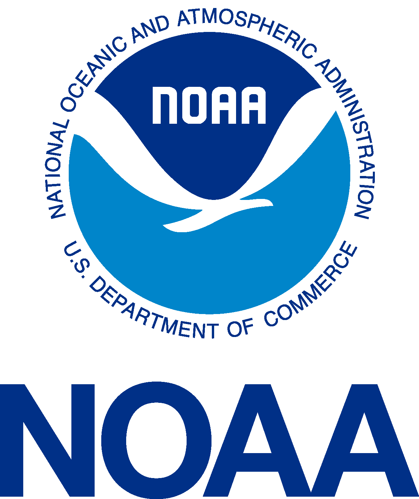{width=60%}
:::
::: {.column width=75% .smaller}
**Matt Grossi**[, Ph.D.]{.small}  
*Data Scientist*  
Advanced Technology and Innovation Branch  
NOAA Fisheries | Southeast Fisheries Science Center   
matt.grossi@noaa.gov
:::
::::

::: {.notes}
Here is my email address, so feel free to reach out to me any time if you have questions. I'll do my best to help.

I've enjoyed being with you all tonight, it's great to be back at Florida Tech, even if virtually! It's very hard to believe how many years have gone by since I last sat where you are, so enjoy your time and experience there. And no matter where you are in your academic preparation, or where you want to end up as a job or career, if you remember one thing from tonight, remember that skills get people jobs. Do well in your classes, yes, because you need to gain subject matter expertise, but use your time as a student wisely to learn as much as you can outside of the classroom. The fact that you're here this evening tells me you're on that right track already. It's an extracurricular activity that you're doing on your time, a professional organization that you're plugging into. You're inviting, listening to, and learning from speakers. You're curiously asking questions and proactively wanting to know about career options. This is all very good stuff, so I applaud you for that. Keep up the good work, and GO PANTHERS!
:::

<!-- ---------------------------------------------------------------------- -->
<!-- EXTRA SLIDES                                                           -->
<!-- ---------------------------------------------------------------------- -->

# Extra Slides {.content-swoop visibility="uncounted"}

## {auto-animate="true" visibility="uncounted" data-menu-title="Spherecam"}


<!-- ---------------------------------------------------------------------- -->

## {auto-animate="true" visibility="uncounted" data-menu-title="Deployment"}


<!-- ---------------------------------------------------------------------- -->

## {transition="fade-in, slide-out" visibility="uncounted" data-menu-title="GFISHER Map"}

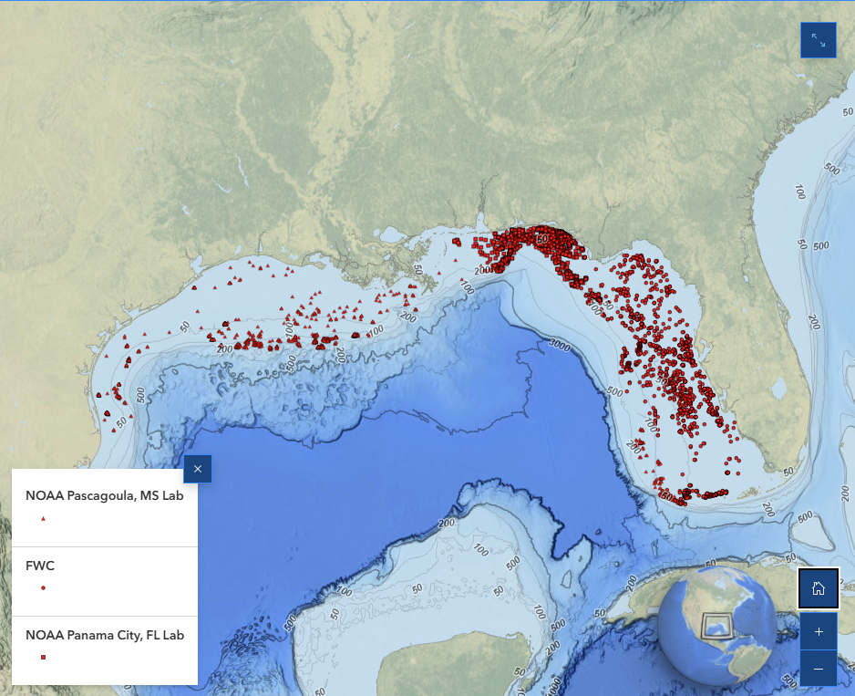

[Learn more about the NOAA RESTORE G-FISHER Program!](https://storymaps.arcgis.com/stories/58708cd2613b4c319f7fb5d98457dfbc)

<!-- ---------------------------------------------------------------------- -->

## {background-image="images/watercolumn.jpg" fig-alt="Underwater photo as sunlight filters through" visibility="uncounted" data-menu-title="Density Prediction"}

<br><br><br><br>

[**Ocean density prediction**]{.largest style="color:white"}

<!-- ---------------------------------------------------------------------- -->

## {background-iframe="https://player.vimeo.com/video/257792941?h=27a0704d2d" visibility="uncounted" data-menu-title="CARTHE Background Story"}

::: {.smallest style="color: white;" .absolute bottom="5" right="0"}
Video courtesy of the University of Miami and the Consortium for Advanced Research on Transport of Hydrocarbon in the Environment (CARTHE)
:::

<!-- ---------------------------------------------------------------------- -->

## {background-image="https://images.marinetechnologynews.com/images/maritime/w800h500/carthe-drifter-78767.jpg" background-size="contain" visibility="uncounted" data-menu-title="Drifter"}

<!-- ---------------------------------------------------------------------- -->

## {background-image="https://images.marinetechnologynews.com/images/maritime/drifter-getting-78764.jpg" background-size="contain" visibility="uncounted" data-menu-title="Drifters on WS"}

<!-- ---------------------------------------------------------------------- -->

## {background-image="https://images.marinetechnologynews.com/images/maritime/w800h500/threemonth-trajectories-78766.jpg" background-size="contain" visibility="uncounted" data-menu-title="Three-month Trajectories"}

<!-- ---------------------------------------------------------------------- -->

## {.content-swoop transition="slide-in fade-out" visibility="uncounted" data-menu-title="Artificial Neural Net"}

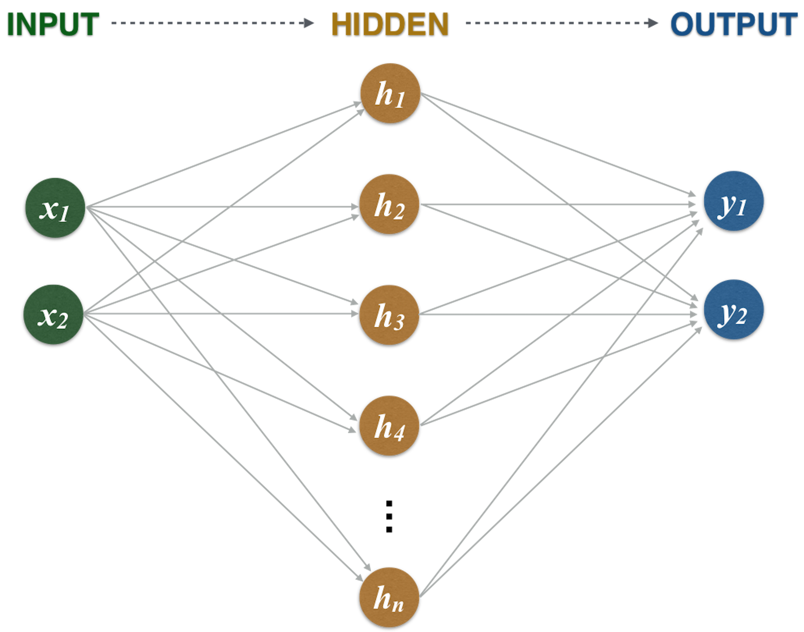

<!-- ---------------------------------------------------------------------- -->

## {.content-swoop transition="fade-in fade-out" visibility="uncounted" data-menu-title="Star Eddy Simulation"}


<!-- ---------------------------------------------------------------------- -->

## {.content-swoop transition="fade-in slide-out" visibility="uncounted" data-menu-title="Star Eddy Results"}

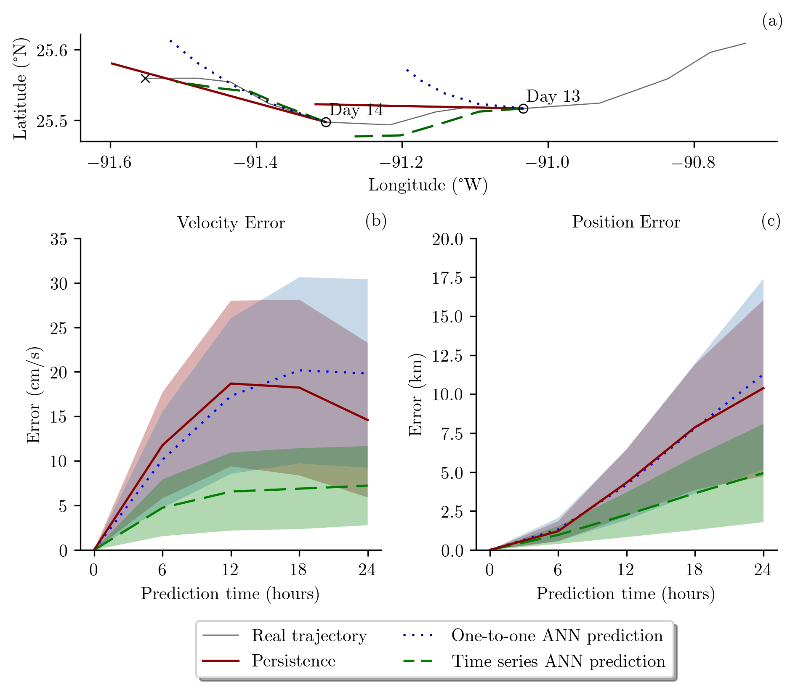

<!-- ---------------------------------------------------------------------- -->

# {background-color="black" visibility="uncounted" data-menu-title="END"}
